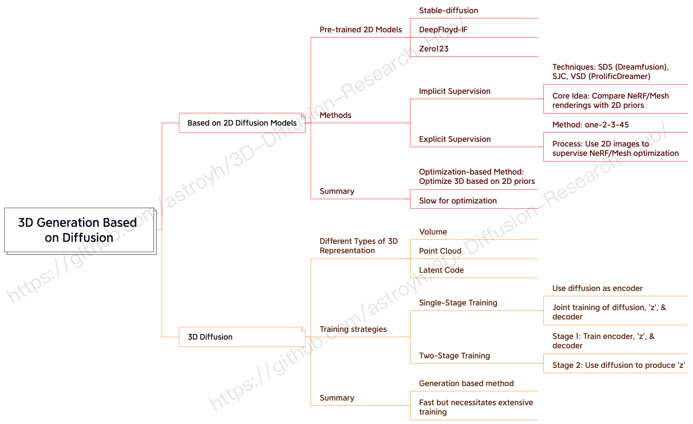

# 🌐 3D-Diffusion-Research-Hub

An awesome list of papers and their respective codebases centered around 3D generation based on diffusion models. If you're a researcher, student, or simply someone interested in this field, this repository should be your go-to place!

---
### 📖 Table of Contents

1. [Intro](#intro)
2. [How to Contribute](#how-to-contribute)
3. [Papers, Codes and Notes](#papers-codes-and-notes)
   - [3D Generation based methods](#3d-generation-based-methods)
   - [2D optimization based methods](#2d-optimization-based-methods)
4. [Related Projects](#related-projects)
5. [Contact](#contact)

---
### 🔍 Intro

This repository is dedicated to collating research articles focused on 3D generation through diffusion methodologies. With an ever-growing number of publications in this domain, it's essential to have a centralized repository to track and follow major developments. 

- **2D Diffusion Models for 3D Generation**: Harnessing the potential of pre-trained 2D diffusion models like Stable-diffusion, DeepFloyd-IF, and Zero123 to optimize 3D representations. Techniques involved include both implicit and explicit supervisions.

- **3D Diffusion for 3D Model Generation**: Exploring direct 3D generation capabilities via 3D diffusion. This encompasses varied 3D representations like volume, point cloud, and the use of shape latent codes. Notable training methodologies include single-stage and two-stage training approaches.

Dive into the repository to find relevant papers, codes, and a rich array of resources to bolster your understanding and advancement in this field!

---
### 📝 How to Contribute

1. **Fork** the repository.
2. **Add** the research paper details in the format provided below.
3. Make sure the paper you're adding isn't already on the list.
4. **Send** a pull request with a brief description of the paper's contribution.

---
### 📚 Papers, Codes and Notes

#### 3D Generation based methods

**Viewset Diffusion: (0-)Image-Conditioned 3D Generative Models from 2D Data**  
*Stanislaw Szymanowicz, Christian Rupprecht, Andrea Vedaldi*  
arXiv 2023.  June, 2023  
   

**Sin3DM: Learning a Diffusion Model from a Single 3D Textured Shape**  
*Rundi Wu, Ruoshi Liu, Carl Vondrick, Changxi Zheng*  
arXiv 2023.  May, 2023  
 

**RenderDiffusion: Image Diffusion for 3D Reconstruction, Inpainting and Generation**  
*Titas Anciukevicius, Zexiang Xu, Matthew Fisher, Paul Henderson, Hakan Bilen, Niloy J. Mitra, Paul Guerrero*  
CVPR 2023.  April, 2023  
   🔥🔥🔥🔥

**Single-Stage Diffusion NeRF: A Unified Approach to 3D Generation and Reconstruction**  
*Hansheng Chen, Jiatao Gu, Anpei Chen, Wei Tian, Zhuowen Tu, Lingjie Liu, Hao Su*  
arXiv 2023.  April, 2023  
   🔥🔥🔥🔥

**MeshDiffusion: Score-based Generative 3D Mesh Modeling**  
*Zhen Liu, Yao Feng, Michael J. Black, Derek Nowrouzezahrai, Liam Paull, Weiyang Liu*  
ICLR 2023.  April, 2023  
   🔥🔥🔥🔥🔥

**3DGen: Triplane Latent Diffusion for Textured Mesh Generation**  
*Anchit Gupta, Wenhan Xiong, Yixin Nie, Ian Jones, Barlas Oğuz*  
arXiv 2023.  March, 2023  
 

**DiffRF: Rendering-Guided 3D Radiance Field Diffusion**  
*Norman Müller, Yawar Siddiqui, Lorenzo Porzi, Samuel Rota Bulò, Peter Kontschieder, Matthias Nießner*  
arXiv 2023.  March, 2023  
  

**Diffusion-SDF: Conditional Generative Modeling of Signed Distance Functions**  
*Gene Chou, Yuval Bahat, Felix Heide*  
arXiv 2023.  March, 2023  
   🔥🔥🔥

**NerfDiff: Single-image View Synthesis with NeRF-guided Distillation from 3D-aware Diffusion**  
*Jiatao Gu, Alex Trevithick, Kai-En Lin, Josh Susskind, Christian Theobalt, Lingjie Liu, Ravi Ramamoorthi*  
arXiv 2023.  February, 2023  
 

**3D-LDM: Neural Implicit 3D Shape Generation with Latent Diffusion Models**  
*Gimin Nam, Mariem Khlifi, Andrew Rodriguez, Alberto Tono, Linqi Zhou, Paul Guerrero*  
arXiv 2022.  December, 2022  
 

**Rodin: A Generative Model for Sculpting 3D Digital Avatars Using Diffusion**  
*Tengfei Wang, Bo Zhang, Ting Zhang, Shuyang Gu, Jianmin Bao, Tadas Baltrusaitis, Jingjing Shen, Dong Chen, Fang Wen, Qifeng Chen, Baining Guo*  
arXiv 2022.  December, 2022  
  

**3D Neural Field Generation using Triplane Diffusion**  
*J. Ryan Shue, Eric Ryan Chan, Ryan Po, Zachary Ankner, Jiajun Wu, Gordon Wetzstein*  
arXiv 2022.  November, 2022  
   🔥🔥🔥🔥

**3D Shape Generation and Completion through Point-Voxel Diffusion**  
*Linqi Zhou, Yilun Du, Jiajun Wu*  
ICCV 2021.  October, 2021  
 

#### 2D optimization based methods

**Generative Novel View Synthesis with 3D-Aware Diffusion Models**  
*Eric R. Chan, Koki Nagano, Matthew A. Chan, Alexander W. Bergman, Jeong Joon Park, Axel Levy, Miika Aittala, Shalini De Mello, Tero Karras, Gordon Wetzstein*  
arXiv 2023.  April, 2023  
 

**Make-It-3D: High-Fidelity 3D Creation from A Single Image with Diffusion Prior**  
*Junshu Tang, Tengfei Wang, Bo Zhang, Ting Zhang, Ran Yi, Lizhuang Ma, Dong Chen*  
arXiv 2023.  April, 2023  
    🔥🔥🔥🔥🔥

**Let 2D Diffusion Model Know 3D-Consistency for Robust Text-to-3D Generation**  
*Junyoung Seo, Wooseok Jang, Min-Seop Kwak, Jaehoon Ko, Hyeonsu Kim, Junho Kim, Jin-Hwa Kim, Jiyoung Lee, Seungryong Kim*  
arXiv 2023.  March, 2023  
   🔥🔥🔥🔥🔥

**SparseFusion: Distilling View-conditioned Diffusion for 3D Reconstruction**  
*Zhizhuo Zhou, Shubham Tulsiani*  
arXiv 2023.  February, 2023  
    🔥🔥🔥🔥

**Score Jacobian Chaining: Lifting Pretrained 2D Diffusion Models for 3D Generation**  
*Haochen Wang, Xiaodan Du, Jiahao Li, Raymond A. Yeh, Greg Shakhnarovich*  
arXiv 2022.  December, 2022  
    🔥🔥🔥🔥

**Novel View Synthesis with Diffusion Models**  
*Daniel Watson, William Chan, Ricardo Martin-Brualla, Jonathan Ho, Andrea Tagliasacchi, Mohammad Norouzi*  
arXiv 2022.  October, 2022  
   🔥

**DreamFusion: Text-to-3D using 2D Diffusion**  
*Ben Poole, Ajay Jain, Jonathan T. Barron, Ben Mildenhall*  
arXiv 2022.  September, 2022  
    🔥🔥🔥🔥🔥

---

#### 🔗 Related Projects

- [Threestudo](https://github.com/threestudio-project/threestudio)

---
#### 💌 Contact

For queries and suggestions related to this repository, please raise an issue or contact the maintainer at [astroyh@qq.com](mailto:astroyh@qq.com).
